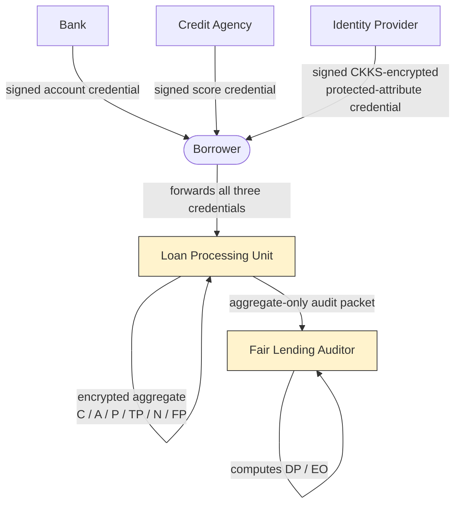

# FairLend

Privacy-preserving protected-attribute fairness auditing for loan-processing systems.

[](https://github.com/mahend72/FairLend-Privacy/actions/workflows/tests.yml)
[](pyproject.toml)
[](LICENCE.txt)


FairLend audits an *already-made* set of loan-approval decisions for
disparity between two protected groups, without ever giving the entity
that made those decisions plaintext access to group membership. A
borrower's protected attribute is issued as a signed, CKKS-encrypted
credential; the Loan Processing Unit (LPU) computes an encrypted
group-similarity score against that credential and homomorphically
accumulates per-group approval/outcome statistics, never decrypting
anything itself. A separate Fair Lending Auditor (FLA) — the only party
holding the CKKS secret key — receives nothing but the final aggregate
statistics and computes demographic-parity (DP) and equalised-odds (EO)
gaps from them.

FairLend does not itself decide, approve, or alter any loan application —
it is an audit layer over decisions a credit-decision model has already
produced. This repository is a research-software reference implementation
and reproducible evaluation, not a production lending system.

## What problem does FairLend solve?

Conventional fairness auditing typically requires the auditor (or the
system being audited) to hold protected attributes in plaintext.
FairLend separates **loan-decision processing** from
**protected-attribute fairness auditing**: the LPU that processes
applications and computes decisions never sees a protected attribute in
plaintext, and the FLA that decrypts fairness-relevant information never
receives anything more granular than the final per-group aggregate
counts.

## Architecture



**Privacy boundary, enforced structurally (checked by tests, not only documented):**

| | LPU | FLA |
|---|---|---|
| Holds `sk_HE` (CKKS secret key) | **No** — construction raises if given a secret-key-bearing context | **Yes** — the only role that ever holds it |
| Sees plaintext protected attribute | **Never** | Only ever sees decrypted *aggregate* group counts, never a per-record value |
| Per-record decryption | **Never performed anywhere in the production path** | Decrypts exactly one aggregate packet per audit run |

## What is implemented?

- LendingClub (2007–2015) preprocessing and leakage-safe train/validation/test splitting
- Controlled, synthetic protected-attribute generation (proxy-correlated, `alpha0`/`alpha1`/seed-parameterised)
- Logistic Regression and Random Forest credit-decision models
- Validation-only decision-threshold policies (including the primary `validation_balanced_accuracy_max`)
- Ed25519-signed Bank / Credit-Agency / Identity-Provider credentials
- CKKS key separation (LPU public/evaluation-only context; FLA-only secret key)
- Binary one-hot encrypted protected-attribute representation
- `compSim` encrypted protected-group similarity matching
- Encrypted C/A/P/TP/N/FP aggregation, aggregate-only LPU→FLA packet
- Demographic parity and equalised-odds computation
- Plaintext-vs-encrypted fairness reconstruction (with a separately labelled raw-CKKS diagnostic)
- Matching-fidelity evaluation (delta*/argmax classification diagnostic)
- Real-data alpha1 × seed sensitivity analysis
- Runtime benchmarking and serialization/communication-size benchmarking (measured, not only analytical)

**Not implemented:** concrete NIZKP proving/verification (see Scope and limitations below).

## Scope and limitations

- **Concrete NIZKP proving/verification is not implemented.** NIZKP relations are formalised at the protocol/design level only (`docs/NIZKP_SCOPE.md`); no `prove()`/`verify_nizkp()` function exists in this codebase.
- **LPU/FLA non-collusion is assumed**, not cryptographically enforced. An LPU–FLA coalition is outside this prototype's threat model.
- **Endpoint compromise and secret-key theft are outside the threat model.** If `sk_HE` or an Ed25519 private key is exfiltrated, the corresponding guarantees no longer hold.
- **Encryption does not prevent protected-attribute proxy inference** from non-sensitive features — see the sensitivity analysis below, which measures exactly this.
- **The protected attribute is synthetic**, generated by this codebase for controlled evaluation — LendingClub provides no observed gender field, and this synthetic label must never be read as real borrower gender.
- **FairLend audits decisions; it does not mitigate detected disparity.** Nothing here changes a model's decisions in response to an audit result.
- **`fairness.minimum_cell_size` (a disclosure/suppression threshold, `k_min`) remains unconfigured (`None`)** — no minimum-cell-size recommendation is made by this repository.
- **This is research software**, not a production lending, KYC, or credit-decision system.

## Dataset

FairLend's real-data evaluation uses the LendingClub accepted-loan
dataset, raw file `accepted_2007_to_2018Q4.csv` (public coverage
2007–2018; this evaluation restricts to the **2007–2015** period).

- **Dataset SHA-256:** `3eae03c28fd9d2e8a076ebeb73507e8d4d0f44d90500decdb0936e0933d1f36a`
- **Cleaned/audit-eligible population:** 887,440
- **Held-out TEST population:** 177,489

**The dataset is not redistributed in this repository.** `data/raw/`,
`data/processed/`, and `data/cache/` are git-ignored except for
placeholder files. See [`data/README.md`](data/README.md) for how to
obtain and prepare it.

## Synthetic protected attribute

LendingClub provides no gender field. FairLend generates a **controlled
synthetic binary protected attribute**,
`Pr(female | x) = sigmoid(alpha0 + alpha1 * z)`, where `z` is a
standardised combination of five non-sensitive proxy components (income,
employment length, DTI, home ownership, region). `alpha1` controls how
strongly the synthetic label correlates with — and is therefore
recoverable from — those proxy features; `alpha1=0` is a negative control
(the label is independent of `z`, i.e. of the proxy features, up to
finite-sample noise).

Primary configuration: `alpha0=0`, `alpha1=0.7`, `seed=0`.

This label is a **synthetic experimental construct**, never real observed
gender.

## Primary real-data results

Source: [`results/evaluation/primary_policy_results.csv`](results/evaluation/primary_policy_results.csv) / [`.json`](results/evaluation/primary_policy_results.json). Threshold policy: `validation_balanced_accuracy_max` (selected from VALIDATION data only).

| Metric | Logistic Regression | Random Forest |
| --- | ---: | ---: |
| tau | 0.80 | 0.80 |
| Approval rate | 0.6591845 | 0.6619058 |
| DP plaintext | 0.0006298859 | 0.0099597935 |
| DP encrypted | 0.0006298859 | 0.0099597935 |
| e_DP | 0 | 0 |
| EO plaintext | 0.0042204779 | 0.0135188006 |
| EO encrypted | 0.0042204779 | 0.0135188006 |
| e_EO | 0 | 0 |

Random Forest shows a numerically larger DP/EO than Logistic Regression
under this fixed policy — this describes a disparity in each model's
*frozen decision policy* under the identical audit, not a general claim
that one model is more accurate, better calibrated, or "fairer" overall;
no such broader comparison is made here.

## Encrypted reconstruction result

**24 of 24** aggregate statistics (12 per model × 2 models: C/A/P/TP/N/FP
for each of two groups) reconstructed **exactly** after CKKS decryption
and count rounding — the same frozen LR/RF decisions produced identical
final DP/EO whether audited via the plaintext path or via FairLend's
encrypted path.

Raw (unrounded) CKKS ciphertext arithmetic is **not** exact: measured
pre-rounding approximation error reached a maximum of 0.0117 (LR) and
0.0536 (RF) — both safely below the 0.5 boundary that count-rounding
requires (rounding safety margin: 0.488 for LR, 0.446 for RF). This
margin, not zero error, is why rounding recovered the exact plaintext
count.

## Matching fidelity

*Encrypted protected-attribute matching fidelity* — not credit-model
accuracy, not a fairness metric. Source: [`results/evaluation/matching_fidelity_summary.csv`](results/evaluation/matching_fidelity_summary.csv), [`matching_threshold.json`](results/evaluation/matching_threshold.json).

| delta* | Accuracy | Macro-F1 | Unmatched rate | Combined MAE |
| ---: | ---: | ---: | ---: | ---: |
| 0.95 | 1.0 | 1.0 | 0.0 | 2.93e-07 |

(delta* selected from the VALIDATION partition only; metrics reported on the full 177,489-row TEST partition.)

## Sensitivity analysis

Real 5 (alpha1) × 10 (seed) × 2 (model) = 100-configuration plaintext
sweep, decisions frozen throughout (only protected-group assignment
varies). Source: [`results/evaluation/alpha1_seed_sensitivity_summary.csv`](results/evaluation/alpha1_seed_sensitivity_summary.csv).

| alpha1 | proxy AUC (mean±std) | LR DP (mean±std) | LR EO (mean±std) | RF DP (mean±std) | RF EO (mean±std) |
| ---: | ---: | ---: | ---: | ---: | ---: |
| 0.0 | 0.5005 ± 0.0009 | 0.0018 ± 0.0015 | 0.0048 ± 0.0055 | 0.0019 ± 0.0015 | 0.0053 ± 0.0057 |
| 0.4 | 0.6101 ± 0.0012 | 0.0022 ± 0.0016 | 0.0062 ± 0.0046 | 0.0056 ± 0.0022 | 0.0074 ± 0.0038 |
| 0.7 | 0.6830 ± 0.0010 | 0.0020 ± 0.0014 | 0.0069 ± 0.0034 | 0.0091 ± 0.0018 | 0.0125 ± 0.0046 |
| 1.0 | 0.7440 ± 0.0009 | 0.0030 ± 0.0021 | 0.0088 ± 0.0025 | 0.0110 ± 0.0019 | 0.0161 ± 0.0056 |
| 1.3 | 0.7927 ± 0.0007 | 0.0058 ± 0.0020 | 0.0111 ± 0.0018 | 0.0115 ± 0.0022 | 0.0178 ± 0.0057 |

At `alpha1=0` proxy AUC sits at chance level (≈0.50, a verified negative
control); at `alpha1=1.3` it reaches ≈0.79. Under the controlled
synthetic-attribute generator, stronger proxy dependence was associated
with increased proxy recoverability and, for these fixed decision
policies, generally larger observed fairness disparities — this is a
statement about this controlled experiment, not a general causal claim
about proxy variables in other settings.

## Performance

**Controlled microbenchmark** (isolated components, small/synthetic
inputs, `time.perf_counter_ns()`, 30 repeats after warm-up) is reported
separately from **observed full-scale application runs** (the actual
177k/266k-record LendingClub runs) — never blended into one number.
Sources: [`results/benchmarks/runtime_summary.csv`](results/benchmarks/runtime_summary.csv), [`benchmark_environment.json`](results/metadata/benchmark_environment.json).

Controlled microbenchmark, batch size = 1:

- `compSim` ≈ 12.7 ms mean
- IP protected-attribute credential issuance ≈ 6.9 ms mean
- FLA aggregate decryption (12 ciphertexts) ≈ 17.6 ms mean
- Bank / CA credential issuance ≈ 0.045 ms / 0.044 ms mean

Observed full-scale real-data runs (not rerun for benchmarking purposes):

| Run | Runtime | Records | Throughput |
| --- | ---: | ---: | ---: |
| Matching fidelity | ≈130 min (7819.66 s) | 266,233 | 34.05 rec/s |
| LR encrypted aggregation | ≈88 min (5273.05 s) | 177,489 | 33.66 rec/s |
| RF encrypted aggregation | ≈94 min (5641.28 s) | 177,489 | 31.46 rec/s |

**Communication** (measured serialized bytes — source: [`results/benchmarks/serialization_measured.csv`](results/benchmarks/serialization_measured.csv), [`communication_summary.csv`](results/benchmarks/communication_summary.csv)):

| Category | Bytes |
| --- | ---: |
| One-time setup (LPU context + reference vectors) | 35,954,285 |
| Per application (Bank + CA + IP credentials) | 1,325,400 |
| Per audit batch (one aggregate packet) | 5,642,620 |

These are **serialized communication payload** sizes, not network
latency or bandwidth measurements — no network transmission was
benchmarked.

## Installation

```bash
python -m venv .venv
source .venv/bin/activate   # Windows: .venv\Scripts\activate
python -m pip install --upgrade pip
pip install -e ".[dev,evaluation]"
```

Requires Python ≥ 3.10 (see `pyproject.toml`). TenSEAL wheel availability
was verified for Python 3.10 and 3.12 (see CI below); other supported
versions should generally work but have not all been individually
checked here.

## Run the test suite

```bash
pytest -v
```

482 tests collected. In a fresh checkout: **480 passed, 2 skipped** — the
two skips are a golden-fixture test parametrized over both models
(`tests/scientific/test_encrypted_aggregation.py`) that only runs once an
optional, gitignored `data/processed/fixture_validation` intermediate has
been separately generated (see "Quick reproducibility check" below); this
is expected in a fresh checkout, not a failure. (If that intermediate is
already present in your working tree — e.g. after running the
reproducibility check below — all 482 pass.) No LendingClub data of any
kind is required either way.

## Quick reproducibility check

These commands exercise the full pipeline — data prep through encrypted
fairness reconstruction and matching fidelity — end-to-end on the small,
tracked, synthetic-scale fixture (`tests/fixtures/lendingclub_sample.csv`)
in well under a minute, without the real LendingClub dataset:

```bash
FX=data/processed/fixture_validation
RX=results/fixture_validation/evaluation

python evaluation/prepare_lendingclub.py --input tests/fixtures/lendingclub_sample.csv --output "$FX" --data-scope synthetic_fixture
python evaluation/split_dataset.py --input "$FX/loan_with_outcome.parquet" --output "$FX" --data-scope synthetic_fixture
python evaluation/generate_synthetic_gender.py --input "$FX/loan_with_outcome.parquet" --split-dir "$FX" --alpha1 0.7 --seed 0 --output "$FX/synthetic_gender_alpha1_0.7_seed_0.parquet" --data-scope synthetic_fixture
python evaluation/train_credit_models.py --input "$FX/loan_with_outcome.parquet" --split-dir "$FX" --data-scope synthetic_fixture
python evaluation/run_plaintext_audit.py --predictions "$RX/model_predictions.parquet" --prepared-data "$FX/loan_with_outcome.parquet" --synthetic-gender "$FX/synthetic_gender_alpha1_0.7_seed_0.parquet" --split-dir "$FX" --alpha1 0.7 --seed 0 --data-scope synthetic_fixture --output "$RX/plaintext_audit.csv"
python evaluation/run_encrypted_audit.py --predictions "$RX/model_predictions.parquet" --plaintext-audit "$RX/plaintext_audit.csv" --synthetic-gender "$FX/synthetic_gender_alpha1_0.7_seed_0.parquet" --split-dir "$FX" --data-scope synthetic_fixture --output "$RX/encrypted_audit_diagnostic.json"
python evaluation/run_fairness_reconstruction.py --predictions "$RX/model_predictions.parquet" --plaintext-audit "$RX/plaintext_audit.csv" --synthetic-gender "$FX/synthetic_gender_alpha1_0.7_seed_0.parquet" --split-dir "$FX" --data-scope synthetic_fixture --output "$RX/fairness_reconstruction.csv"
python evaluation/run_matching_fidelity.py --synthetic-gender "$FX/synthetic_gender_alpha1_0.7_seed_0.parquet" --split-dir "$FX" --data-scope synthetic_fixture --n-runs 10 --output-dir "$RX" --alpha1 0.7 --seed 0
```

## Reproducing the LendingClub evaluation

See [`data/README.md`](data/README.md) for dataset acquisition. High-level steps (each backed by a script in `evaluation/`):

1. Obtain the raw CSV and place it under `data/raw/`.
2. Prepare/filter to the 2007–2015 evaluation window (`evaluation/prepare_lendingclub.py`).
3. Split into train/validation/test (`evaluation/split_dataset.py`).
4. Generate the synthetic protected attribute (`evaluation/generate_synthetic_gender.py`).
5. Train the credit-decision models (`evaluation/train_credit_models.py`).
6. Run the plaintext audit (`evaluation/run_plaintext_audit.py`) and/or the primary-policy encrypted audit (`evaluation/run_primary_policy_encrypted_audit.py`).
7. Consolidate results (`evaluation/build_primary_policy_results.py`).

**Warning:** the full real-data *encrypted* evaluation (matching fidelity
plus LR/RF encrypted aggregation) took roughly **5 hours of CPU time in
total** in this project's own measured runs (Sec. "Performance" above).
Do not launch it without expecting a multi-hour run.

## Result artifact index

| Result | Artifact |
| --- | --- |
| Primary LR/RF DP/EO, approval rate | `results/evaluation/primary_policy_results.csv` / `.json` |
| Matching fidelity | `results/evaluation/matching_fidelity_summary.csv` |
| Sensitivity sweep (100 rows) / summary | `results/evaluation/alpha1_seed_sensitivity_runs.csv` / `alpha1_seed_sensitivity_summary.csv` |
| Runtime benchmarks | `results/benchmarks/runtime_summary.csv` |
| Serialization sizes (measured) | `results/benchmarks/serialization_measured.csv` |
| Communication paths/projections | `results/benchmarks/communication_summary.csv` |

Full mapping (every headline result → exact artifact → generating
script): [`docs/RESULT_ARTIFACT_INDEX.md`](docs/RESULT_ARTIFACT_INDEX.md).
Full narrative results write-up:
[`docs/FINAL_REPRODUCIBLE_RESULTS.md`](docs/FINAL_REPRODUCIBLE_RESULTS.md).
Manuscript-vs-implementation comparison (audit metadata, not a target the
implementation is tuned toward):
[`docs/MANUSCRIPT_EVIDENCE_STATUS.md`](docs/MANUSCRIPT_EVIDENCE_STATUS.md).

## Security model

| Role | Assumption |
| --- | --- |
| Bank, Identity Provider, Credit Agency | Trusted |
| LPU, FLA | Semi-honest, non-colluding |
| Borrower | Potentially malicious |

The central enforced invariant: **the LPU cannot decrypt the protected
attribute, because it never possesses `sk_HE`** — its CKKS context is
constructed via `derive_lpu_context`, which structurally strips the
secret key, and every encrypted-computation entry point
(`comp_sim`, `compute_encrypted_audit`, `LoanProcessingUnit.__init__`)
raises if given a context that could decrypt. This is checked by
dedicated tests (`tests/scientific/test_key_separation.py`,
`test_key_ownership.py`), not only documented.

LPU/FLA collusion resistance is **not** implemented or claimed — the
security model assumes non-collusion between these two roles.

## Historical prototype

[`legacy/secureloan_2023/`](legacy/secureloan_2023/) contains an earlier,
unrelated predecessor project ("Secure Loan Verification and Approval
System"). It does **not** implement the current FairLend architecture
described above, and its code is preserved for historical reference only,
not maintained or extended. The `.pem` files under
`legacy/secureloan_2023/Public_private_key_pairs/` are **historical,
demo-only key material and must never be reused for anything real**.

## Project structure

```
src/fairlend/     FairLend package: crypto, credentials, roles, audit, data, models, benchmarks
evaluation/       CLI scripts orchestrating the above into reproducible experiments
tests/            unit / integration / scientific test suites
results/          tracked result artifacts (evaluation/, benchmarks/, metadata/)
docs/             evidence status, final results, artifact index, scope notes
legacy/           historical predecessor prototype (unrelated architecture)
```

## License

MIT License — see [`LICENCE.txt`](LICENCE.txt).
